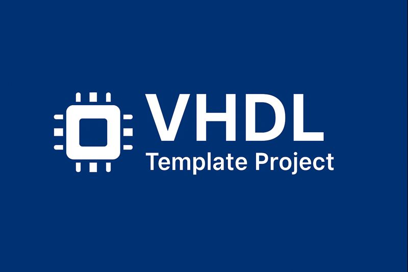
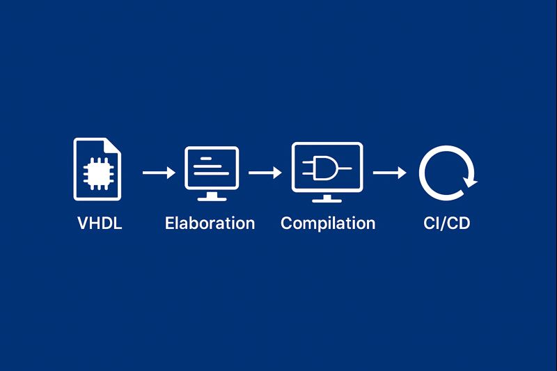

<h1 style="text-align: center;">VHDL Template Project </h1>

A reusable, FOSS-focused VHDL project template designed for scalable hardware development, simulation, verification and documentation.



---
## Table of Contents  
- Introduction  
- Features  
- Architecture Diagram  
- Directory Structure  
- Toolchain and Dependencies  
- Scripts  
- Build and Simulation  
- Testing  
- Continuous Integration  
- Contribution Guidelines  
- License  
- References

---

# Introduction  
This repository provides a structured, opinionated template for VHDL projects that prioritize open-source (FOSS) tooling. 

It is intended for personal use, learning new tools and professional digital design workflows. 

The template includes simulation flows, testbench support, automation scripts, and optional integration with higher-level FOSS HDL tools.


### Currrent TODOs
- [ ] make scripts auto documented with SPHYNX
- [ ] Wavedrom support in VHDL autodocs
- [ ] Project templater to update __*.vhd__ files 
- [ ] Project templater to update __*.rst__ files 
- [ ] Python script to autogenerate __*.rst__ files

---

# Features  


- FOSS-first design, simulation, and debugging workflow  
- Modular directory hierarchy for multi-module designs  
- Script-driven build, test, and lint processes  
- Optional integration with VUnit and Yosys  
- CI-ready structure with optional workflow examples  

---

# Architecture Diagram  


This diagram illustrates a typical organization of VHDL entities, architectures, and testbenches within the project. Adapt or replace the image based on your design.

---

# Directory Structure  
``` bash
project-root/
├─ .github/ # CI/CD pipleline files
│       └─ workflows / 
│               └─ doc.yml # Pipeline file
├─ .venv/ # Pyrhon virtual environment manager
│
├─ doc/ # Documentation and image assets
│
├─ regs/ # RGGEN files needed to generate register files
│       ├─ config.yml
│       └─ reg_map.yml
│
├─ scripts/ # Build, simulation, lint, and CI scripts
│       ├─ templater/ # Contains all scripts that are relevant to creating a project
│       │       ├─ Project_init.py # script to auto update template to a usable project.
│       │       └─ .project_generared # file that determines if the project templater has been run
│       └─ doc_gen/ # All scritpts required to autogenerate documentation
│      
├─ src/ # VHDL source files (entities, architectures, packages)
├─ deps/ # pull in other repositories
├─ test/ # Testbenches for unit and integration-level testing
├─ sim/ # Simulation outputs (VCD, FST, logs)
├─ run.py
├─ Bender.yaml
├─ Makefile
└─ README.md # The file you are reading now :)

```

## Scripts description


---

# Toolchain and Dependencies  

This template uses an entirely open-source toolchain. All tools listed below are actively maintained and widely used within the open HDL community.

## Primary Tools  
- **GHDL** – Open-source VHDL simulator and synthesis front-end  
  https://github.com/ghdl/ghdl  

- **GTKWave** – Waveform viewer supporting VCD, FST, and LXT  
  https://github.com/gtkwave/gtkwave  

- **Yosys** (optional) – Synthesis framework with `ghdl-yosys-plugin`  
  https://github.com/YosysHQ/yosys  

- **VUnit**  – Automated test framework for VHDL  
  https://github.com/VUnit/vunit  

- **Bender** (optional) – HDL dependancy manager  
  https://github.com/pulp-platform/bender

## Additional Utilities  
Include any formatting, linting, or auxiliary tools relevant to your workflow.

### Requires Utilities
- **FZF** - Command line fuzzy finder, used to within the makefile
    https://github.com/junegunn/fzf

- **PIP** - Python utility to install all packages under .venv


---

# Scripts  


Scripts located in the `scripts/` directory automate common tasks across different environments.

### Included Scripts  
- `build.sh` – Analyzes and compiles all VHDL sources  
- `run.sh` – Executes simulations and produces waveforms  
- `lint.sh` – Performs static analysis or linting  
- `clean.sh` – Removes all temporary build and simulation artifacts  
- `ci.sh` – Consolidated entry point for continuous integration workflows  

### Typical Usage  
./scripts/build.sh
./scripts/run.sh --tb=my_testbench
./scripts/lint.sh
./scripts/clean.sh


---

# Build and Simulation  

Below is the standard simulation flow using GHDL and GTKWave.

### Example GHDL Build Flow  
Analyze source files
ghdl -a src/*.vhd
Elaborate the top-level entity
ghdl -e top_entity
Run simulation and generate waveform
ghdl -r top_entity --vcd=sim/output.vcd


### Viewing Waveforms  
gtkwave sim/output.vcd &

---

# Testing  

If integrating **VUnit**, include a simple test runner such as `run.py`:


python3 run.py
Document your testbench naming conventions, expected outputs, and test structure.

---

# Continuous Integration  


CI pipelines may be implemented using GitHub Actions, GitLab CI, or similar frameworks. Example workflow files may be placed in:
.github/workflows/

---

# License  
Specify your chosen license here (e.g., MIT, BSD-3-Clause, Apache-2.0).  
See the LICENSE file for full legal text.

---

# References  
- IEEE 1076 VHDL Language Reference Manual  
- GHDL Documentation  
- GTKWave Documentation  
- YosysHQ Documentation  
- VUnit User Guide  

---


